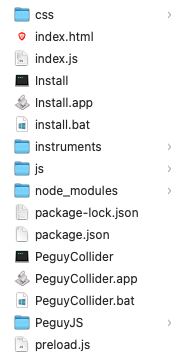

# Péguy Collider
Péguy Collider is a music procedural generation software based on [Electron](https://www.electronjs.org/), [Péguy.js](https://github.com/Killfaeh/Peguy.js) and [Tone.js](https://github.com/Tonejs/Tone.js) inspired by [Super Collider](https://supercollider.github.io/) in some way.</br>

You can use it to generate and export melodies to use them in your favorite DAW or to edit and play generated music live.

## Installation

### Install Node.js

You need to install Node.js to run Péguy Collider.

**Windows**

Download the installation file on Node.js web site : [https://nodejs.org/fr/download/prebuilt-installer](https://nodejs.org/fr/download/prebuilt-installer) </br>
Run it as administrator.

**Mac OS**

Open a terminal. </br>
Install Homebrew if you haven't already.

```bash
/bin/bash -c "$(curl -fsSL https://raw.githubusercontent.com/Homebrew/install/HEAD/install.sh)"
```

Then, install Node.js and npm.

```bash
brew install node
brew install npm
```

**Linux**

Open a terminal and run these 2 commands.

```bash
sudo apt install nodejs
sudo apt install npm
```

### Download and extract the archive

Download the project archive via this Google Drive link : [https://drive.google.com/file/d/1wTu-5JXfgBaB0hdBMiQZnE-KP6eYpOSE/view?usp=sharing](https://drive.google.com/file/d/1wTu-5JXfgBaB0hdBMiQZnE-KP6eYpOSE/view?usp=sharing) </br>
Then, extract it.

<div align="center">
</br>
Archive content
</div>

### Run the application

**Windows**

If you run Péguy Editor for the first time, run install.bat (double click).</br>
Then, run PeguyCollider.bat (double click).

**Mac OS**

Run PeguyCollider.app (double click).</br>
You can put PeguyCollider.app in your dock.

**Linux**

Run PeguyCollider in a terminal.

## How to use

### Basics

Here is how looks the interface.</br>

<div align="center">

</div></br>

A Péguy Collider project is a directory containing a file named project.json and a file named main.js. 
If you add new scripts to the project, they will be saved in this directory.</br>
To open an existing project, you have to open the project.json file of the project.</br>

To test your program, you just need to click on the left top green arrow. The generated melody is played in an loop until you click on the stop icon.</br>
You can edit your program the same time music is played and click on the refresh icon. 
When Peguy Collider has finished playing the current iteration of the old loop, it moves on to the new one. 
So, you can use Péguy Collider live, like a traditional instrument.</br>

The quick code panel at right help you to write your code faster. 
Double click on the label or simple click on the copy/paste icon of the row which interests you and a code block will be pasted in your code.</br>

To add a script in your project, you have to click on the add file icon on the left top, near the double arrow. </br>

<div align="center">

</div></br>

Then, enter a name and click on the Ok button.</br>

A common use of the multiscript approach is to create all instruments used in the project and store them appart.</br>

<div align="center">

</div></br>

Then, to use others scripts in the project call them with the instruction loadScript('name-of-the-script'); for each additional script in the main script.</br>

<div align="center">

</div></br>

### Export to MIDI and other DAW
